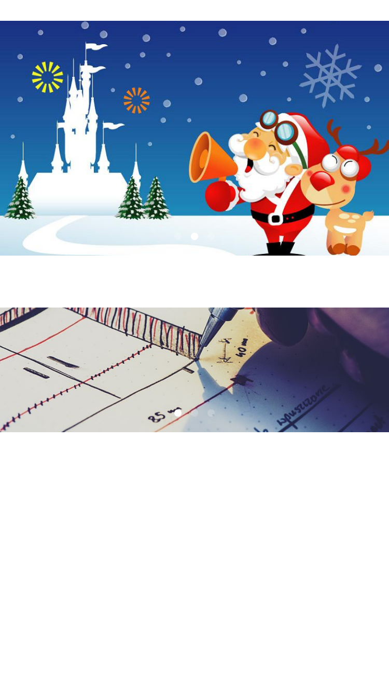

#  Reindeer

[](http://cocoapods.org/pods/Reindeer)
[](http://cocoapods.org/pods/Reindeer)
[](http://cocoapods.org/pods/Reindeer)

A rolling image banner view for app display some promotion elements, support remote image and auto rolling. You can use both autolayout and programming to create the banner view.



## Feature

- [x] Image banner
- [x] Remote image and local banner
- [x] Tapped block
- [x] page control
- [x] auto rolling
- [x] autolayout support

## Installation

Reindeer is available through [CocoaPods](http://cocoapods.org). To install
it, simply add the following line to your Podfile:

```ruby
pod "Reindeer"
```

## Usage

To run the example project, clone the repo, and run `pod install` from the Example directory first.

### Read before use

If you want to get remote images as your banner content, you can just write a image url in the images array. In this case, you should customize a remote image fetcher, you can use [SDWebImage](https://github.com/rs/SDWebImage) or [Kingfisher](https://github.com/onevcat/Kingfisher). Here has a usage with [Kingfisher](https://github.com/onevcat/Kingfisher):
```swift 
banner.setRemoteImageFetche({ (imageView, url, placeHolderImage) -> Void in
    imageView.kf_setImageWithURL(NSURL(string: url)!, placeholderImage: placeHolderImage)
})
```

If you want to programming use banner view, it's better if you use a autolayout tool, such as: [SnapKit](https://github.com/SnapKit/SnapKit).
```swift
bannerController.view.snp_makeConstraints { (make) -> Void in
    make.edges.equalTo(self.bannerWrapView)
}
```

### Programming usage

A full programming usage example:

- define a banner controller first

```swift
var _bannerController: BannerPageViewController?
```

- init the banner controller

```swift
func initRollingBanner() {
    _bannerController = BannerPageViewController()

    if let bannerController = _bannerController {
        self.addChildViewController(bannerController)

        // the `self.bannerWrapView` can be replaced with the view you want to add the banner.
        self.bannerWrapView.addSubview(bannerController.view)
        bannerController.view.snp_makeConstraints { (make) -> Void in
            make.edges.equalTo(self.bannerWrapView)
        }

        bannerController.didMoveToParentViewController(self)
        bannerController.interval = 5
        bannerController.placeholderImage = UIImage(named: "banner_holder")

        bannerController.setRemoteImageFetche({ (imageView, url, placeholderImage) -> Void in
            imageView.kf_setImageWithURL(NSURL(string: url)!, placeholderImage: placeholderImage)
        })

        bannerController.setBannerTapHandler({ (index) -> Void in
            print("image with index \(index) tapped")
        })
    }
}
```

- render the banner, and start rolling

```swift
if let bannerController = _bannerController {
    anotherBanner.images = [
        "https://cdn-ifnotalk-com.alikunlun.com/images/3/cd/cbf38bc67d58fb61c42a14f6b468c.jpg",
        UIImage(named: "reindeer-1"),
        UIImage(named: "reindeer-2")
    ]

    anotherBanner.startRolling()
}

```


### Storyboard usage

You can clone this repo and see the storyboard usage, don't forget to run `pod install` first, because the example use [Kingfisher](https://github.com/onevcat/Kingfisher) as image fetcher and [SnapKit](https://github.com/SnapKit/SnapKit) layout in programming.

```swift
if let banner = segue.destinationViewController as? BannerPageViewController {

    // (Optional) Set the rolling interval, 0 means no auto-rolling
    banner.interval = 5

    // (Optional) Set placeholder image
    banner.placeholderImage = UIImage(named: "placeholder")

    // (Optional, Need with Remote Images) Set remote image fetcher
    banner.setRemoteImageFetche({ (imageView, url, placeHolderImage) -> Void in
        imageView.kf_setImageWithURL(NSURL(string: url)!, placeholderImage: placeHolderImage)
    })

    // (Optional) Set banner tapped hander
    banner.setBannerTapHandler({ (index) -> Void in
        print("banner with index \(index) tapped.")
    })

    // (Need) Set images
    banner.images = [
        "https://cdn-ifnotalk-com.alikunlun.com/images/3/cd/cbf38bc67d58fb61c42a14f6b468c.jpg",
        UIImage(named: "reindeer-1"),
        UIImage(named: "reindeer-2")
    ]

    // (Optional) Start auto rolling
    banner.startRolling()
}

```

